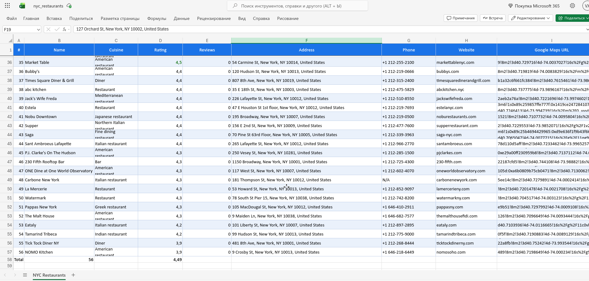

# Google Maps Business Scraper

Collects business listings from Google Maps for any search query and exports
them to a formatted Excel report. Built for lead lists and market research,
where copying results by hand stops being realistic past a few dozen entries.



## What it collects

| Field | Description |
|---|---|
| Name | Business name |
| Cuisine / Category | Category shown on the place page |
| Rating | Average rating |
| Reviews | Review count |
| Address | Full address |
| Phone | Phone number if published |
| Website | Website if published |
| Google Maps URL | Direct link to the listing |

Results are sorted by rating, with review count as a tiebreaker, so the
strongest places land at the top. Places with no rating go last.

## How it works

The results panel is scrolled until no new cards appear for several rounds.
Then every place URL is collected as a plain string *before* any navigation
happens, and each page is opened directly by URL. Holding on to element
references across navigation is what produces `StaleElementReferenceException`
in Maps scrapers; strings have no DOM dependency, so the run stays stable.

Each field is extracted independently and falls back to `N/A` rather than
aborting the run, since not every business publishes a phone or a website.
Missing selectors are logged and the scraper moves on.

The driver runs with anti-automation flags and a normal user agent, and the
`navigator.webdriver` property is hidden.

## Output

A styled workbook with a frozen header row, alternating row colors, ratings
above 4.5 highlighted, and a summary row with the total count and average
rating.

## Stack

Python · Selenium · openpyxl

## Installation

```bash
git clone https://github.com/VanguardXs/google-maps-scraper.git
cd google-maps-scraper
pip install -r requirements.txt
```

Chrome and a matching chromedriver need to be available on the system.

## Usage

The run is configured at the top of `google_maps_scraper.py`:

```python
SEARCH_QUERY = "restaurants in New York"
MAX_RESULTS  = 60
OUTPUT_FILE  = "nyc_restaurants.xlsx"
HEADLESS     = False
```

Then:

```bash
python google_maps_scraper.py
```

The query is not limited to restaurants — anything Google Maps can search
("dentists in Chicago", "gyms in Berlin") works the same way.

## Notes

- Google changes its markup periodically. The search box is looked up through
  a list of fallback selectors, but the place-page selectors may need updating
  over time.
- Scroll pauses and page waits are deliberate. Lowering them makes runs faster
  and less reliable.

## License

Released under the [MIT License](LICENSE).
